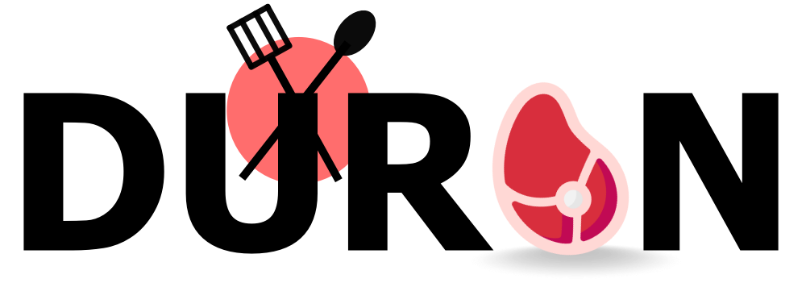

# Duran - SaaaS (En este casi adaptado a una carnicería, es raro? Sí, pero es lo que hay) 🥩



**Duran** es una aplicación web moderna diseñada para simplificar y optimizar la gestión diaria de carnicerías. Su característica distintiva es su **arquitectura multi-inquilino**, que permite que múltiples negocios de carnicería independientes utilicen la misma instancia de la aplicación de forma segura, manteniendo sus datos completamente aislados y privados.

[](enlace_a_tu_ci_cd)
[](LICENSE)

## Tabla de Contenidos

*   [Descripción](#descripción)
*   [Características Principales](#características-principales)
*   [Enfoque Multi-Empresa](#enfoque-multi-empresa)
*   [Stack Tecnológico](#stack-tecnológico)
*   [Prerrequisitos](#prerrequisitos)
*   [Instalación](#instalación)
*   [Uso](#uso)
*   [Configuración Multi-Inquilino](#configuración-multi-inquilino)
*   [Contribuciones](#contribuciones)
*   [Licencia](#licencia)
*   [Contacto](#contacto)

## Descripción

El objetivo de Duran es proporcionar a los dueños y empleados de carnicerías una herramienta intuitiva y potente para manejar inventario, ventas, clientes, proveedores y reportes. Al ser una aplicación web, es accesible desde cualquier dispositivo con conexión a internet.

## Características Principales

*   **Gestión de Inventario:** Control detallado de productos (tipos de carne, cortes), stock, lotes.
*   **Punto de Venta (POS):** Interfaz rápida y sencilla para registrar ventas, aplicar descuentos y gestionar pagos.
*   **Gestión de Clientes:** Base de datos de clientes, historial de compras.
*   **Gestión de Proveedores:** Seguimiento de proveedores y compras.
*   **Reportes:** Generación de informes de ventas, inventario, ganancias, etc.
*   **Roles y Permisos:** Diferentes niveles de acceso para administradores y empleados.
*   **Panel de Administración Central:** Para la gestión de los inquilinos (empresas). *(Solo accesible por el superadministrador de la plataforma)*.
*   **Panel por Empresa:** Cada carnicería tiene su propio panel de gestión aislado.

## Enfoque Multi-Empresa

La aplicación está diseñada desde cero con una arquitectura **multi-inquilino**. Esto significa que:

1.  **Aislamiento de Datos:** Los datos de cada carnicería (productos, ventas, clientes, etc.) están lógicamente separados. Una empresa no puede acceder a los datos de otra.
2.  **Configuración por Empresa:** Cada negocio puede tener configuraciones específicas ya sea, sus logos, precios, roles, usuarios.
3.  **Escalabilidad:** La plataforma puede crecer para dar servicio a múltiples carnicerías sin necesidad de desplegar instancias separadas para cada una (Aunque no se descarta la opción de crear nuevas instancias para una empresa, si es necesitado).
4.  **Mantenimiento Centralizado:** Las actualizaciones y el mantenimiento se aplican a la instancia central, beneficiando a todos los inquilinos simultáneamente.

## Stack Tecnológico

*   **Frontend:** React + Typescript usando global states con Zustand
*   **Backend:** Java usando el framework Springboot.
*   **Base de Datos:** PostgreSQL & Redis para cache.

## Prerrequisitos

Asegúrate de tener instalado lo siguiente en tu sistema:

*   Node.js 18 o superior. 
*   npm, pnpm o yarn para administrar los paquetes.
*   Git para el manejo de versiones en la rama dónde vaya tu contribución.
*   **Próximanmente se agregará una API para desarrollo y asegurar el correcto funcionamiento.** 

## Instalación

Sigue estos pasos para poner en marcha el proyecto en tu entorno local:

1.  **Clona el repositorio:**
    ```bash
    git clone https://github.com/anthonycursewl/meat-swt-app.git
    cd meat-swt-app
    ```

2.  **Instala las dependencias del Frontend:**
    ```bash
    cd meat-swt-app
    npm install
    # o yarn install
    # o pnpm install
    ```

2.  **Inicia la aplicación:**
    ```bash
    # Una vez las dependencias instaladas ejecuta el siguiente comando:
    npm run dev 
    ```

3.  Abre tu navegador y ve a `http://localhost:5173`

## Configuración Multi-Inquilino

*   **Creación de Inquilinos:** Cada usuario tiene roles. Estos roles le permiten realizar ciertas acciones. Dependiendo del tipo de usuario podría acceder a ciertas acciones si así lo desea el super-usuario. Al crear una cuenta, el super-usuario puedes crear más cuentas y manejar los roles independientemente de cada usuario para manejar tanto como sus sesiones como actividad.
*   **Acceso por Inquilino:** Cada super-usuario se identifica como una empresa, con este enfoque el super-usuario ya tiene sus datos empresariales aislados de las demás entidades empresariales. Cada usuario que se cree desde un super usuario de una empresa, de manera lógica el mismo usuario pertenecerá a la misma empresa desde dónde se creó.

## Contribuciones

¡Las contribuciones son bienvenidas! Si deseas mejorar Duran, por favor sigue estos pasos:

1.  Haz un Fork del repositorio.
2.  Crea una nueva rama para tu feature o bugfix (`git checkout -b feature/nueva-funcionalidad` o `bugfix/arreglo-specifico`).
3.  Realiza tus cambios y haz commit (`git commit -m 'Añade nueva funcionalidad X'`).
4.  Empuja tus cambios a tu fork (`git push origin feature/nueva-funcionalidad`).
5.  Abre un Pull Request hacia la rama `main` (o `develop`) del repositorio original.

Por favor, asegúrate de que tu código siga las guías de estilo del proyecto y que (si aplica) los tests pasen.

## Licencia

Este proyecto está licenciado bajo la Licencia MIT. Consulta el archivo [LICENSE](LICENSE) para más detalles.

## Contacto

Breadriuss - zerpaanthony.wx@breadriuss.com